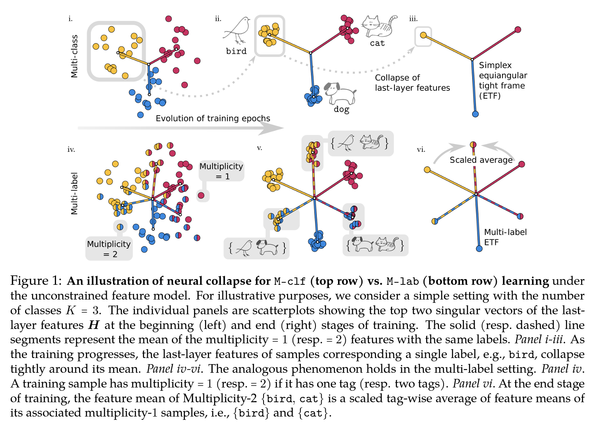

# Neural Collapse in Multi-label Learning with Pick-all-label Loss

This is the code for the [paper](https://arxiv.org/abs/2310.15903) "Neural Collapse in Multi-label Learning with Pick-all-label Loss".

## Introduction

We study deep neural networks for the multi-label classification (MLab) task through the lens of neural collapse (NC). Previous works have been restricted to the multi-class classification setting and discovered a prevalent NC phenomenon comprising of the following properties for the last-layer features: (i) the variability of features within every class collapses to zero, (ii) the set of feature means form an equi-angular tight frame (ETF), and (iii) the last layer classifiers collapse to the feature mean upon some scaling. We generalize the study to multi-label learning, and prove for the first time that a generalized NC phenomenon holds with the "pick-all-label'' formulation. Under the natural analog of the unconstrained feature model (UFM), we establish that the only global classifier of the pick-all-label cross entropy loss display the same ETF geometry which further collapse to multiplicity-1 feature class means. Besides, we discover a combinatorial property in generalized NC which is unique for multi-label learning that we call ``tag-wise average'' property, where the feature class-means of samples with multiple labels are scaled average of the feature class-means of single label tags. Theoretically, we establish global optimality result for the pick-all-label cross-entropy risk for the UFM. Additionally, We also provide empirical evidence to support our investigation into training deep neural networks on multi-label datasets, resulting in improved training efficiency.

<p float="left" align="center">
 
</p>

## Environment

Please check the requirement.txt

## Create Multi-Label datasets with MNIST and CIFAR-10

Please refer to `Exp_MNIST.ipynb` and `Exp_CIFAR.ipynb` for the generation of the Multi-label datasets, and `define_data.py` for the usage. Also considering changing the save and load path for the datasets. 

For the SVHN dataset, we use this [link](https://www.kaggle.com/datasets/stanfordu/street-view-house-numbers) for downloading. Please also check `Exp_SVHN.ipynb` for our preprocessing of the dataset.

## Training

For standard training
~~~python
$ sh submit_param_eff.sh <Network Architecture> <Saved Generated Dataset Path or SVHN>
~~~

For training with fixed ETF classifier
~~~python
$ sh submit_param_eff_etf.sh <Network Architecture> <Saved Generated Dataset Path>
~~~

**Note:** Please consider adding the `--checkpoint_path` argument in the sh files for the desired path to save model checkpoints

There are many other training options, e.g.,   `--epochs`, `--lr` and so on, which can be found in `train_param_eff.py`.

## Validating NC phenomenon

Please refer to the `submit_validate.sh` for example usage. After running, the NC metrics will be saved as a pickle file: `info_<dataset>.pkl` in the same directory as the saved model checkpoints.

## Citation and reference 
For technical details and full experimental results, please check [our paper](https://arxiv.org/abs/2310.15903).
```
@article{li2023neural,
      title={Neural Collapse in Multi-label Learning with Pick-all-label Loss}, 
      author={Pengyu Li and Yutong Wang and Xiao Li and Qing Qu},
      year={2023},
      eprint={2310.15903},
      archivePrefix={arXiv},
      primaryClass={cs.LG}
}
```
